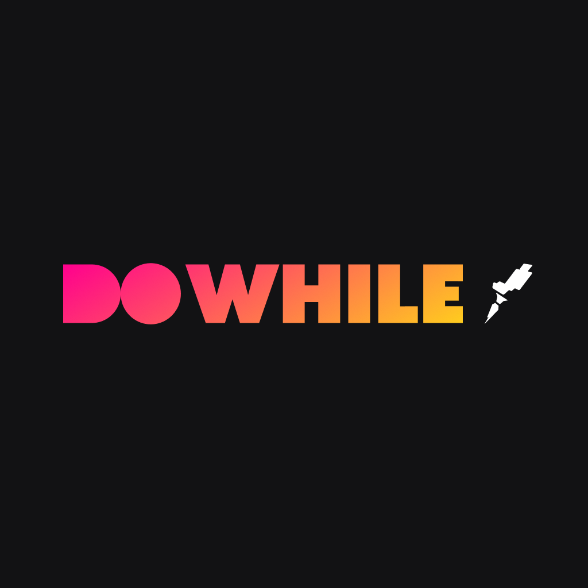

<h1 align = "center">
  <br>
    
  <br>
  <br>
  NLW Heat - Node.js
</h1>

<p align = "center">Backend feito em prisma e utilizando socket.io para comunicação em tempo real :iphone: </p>

<p align = "center">
  <a href="https://opensource.org/licenses/MIT">
    
  </a>
</p>

<hr />

## ⚛️ Tecnologias
[//]: # (Adicione os recursos do seu projeto aqui :)

- [TypeScript](https://www.typescriptlang.org/)
- [Express](https://expressjs.com/pt-br/)
- [Prisma](https://www.prisma.io/)
- [JSON Web Token](https://jwt.io/)
- [Socket.IO](https://socket.io/)


## :rocket:  Começando

- Para clonar e acessar este aplicativo :

```bash
# Clone o repositório e acesse a pasta
$ git clone https://github.com/AdrianoCostaJHP/nlw-heat-node.git
$ cd nlw-heat-node

```
- Configurar um arquivo .env:
```
# Faça uma copia do arquivo .env.example para .env e preencha com as suas credenciais do GitHub; 
```

- Instalar dependências e executar o aplicativo :
```
# Instale as dependências do projeto
$ yarn

# Execute as migrations do prisma
$ yarn prisma migrate dev

# Inicie o servidor
$ yarn dev
```
Obs.: Nesse projeto temos autenticação via [OAuth](https://docs.github.com/pt/developers/apps/building-oauth-apps/authorizing-oauth-apps) com o GitHub


## :page_facing_up: Licença

Este projeto está licenciado sob a Licença MIT - consulte a página [LICENÇA](https://opensource.org/licenses/MIT) para obter detalhes.

---

Feito por ♥ por Adriano Costa :wave: [Meu LinkedIn!](https://www.linkedin.com/in/adriano-costa-101395141/)
